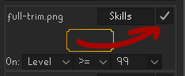

# Max Skill Trim

This plugin adds a visual border around skills that you have achieved 99 in.

## Submitting custom trims

Look at branch [custom trims](https://github.com/NathanQuayle/max-skill-trim/tree/custom-trims).

## Installing custom trims

Any image can be used as a trim.  
You can find a lot of premade trims [here](https://nerdpuff.github.io/max-skill-trim/)

To install:    
Drop the trim image file into the trims folder, which can be opened from the side-panel.  
Refresh from the side-panel or restart runelite.  
New trims start out as disabled, enable them by checking the box in the top right of their configuration  

## Customizing conditions

You can customize when a trim is applied by changing condition expression on the bottom.  
It is made up of three parts:
#### Left
| Value   | defition                                |  
|---------|-----------------------------------------|  
| `Level` | Real level (bottom right number)        |  
| `Curr`  | Boosted/Drained level (top left number) |  
| `xp`    | Amount of xp in the skill               |  

#### Operator

| Value | defition         |  
|-------|------------------|  
| `=`   | Equal            |  
| `<`   | Less             |  
| `<=`  | Less or equal    |  
| `>`   | Greater          |  
| `>=`  | Greater or equal |  
| `!=`  | Not equal        |  

#### Right

Can be the same values as the left side or a number.    
Supports suffixes e.g. `200m` `150k` `99` `92`  etc 

There is also a secret (only partially supported) `Base` which is the lowest real level among your skills.  
For example `Level = Base` would highlight your lowest level skill

## Screenshots

Full trim example

